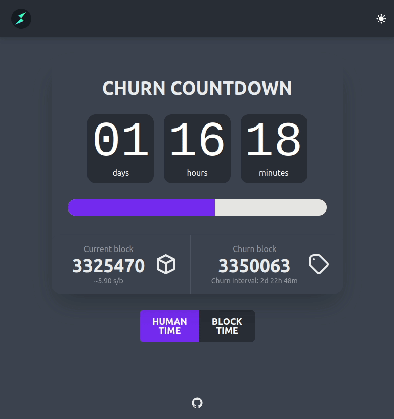

# THORChain Churn Countdown

https://veado.github.io/thorchain-churn-countdown

## How does it work

The app fetches data from `Midgard` (churn interval, last churn) and subscribes to [THORChains](https://docs.thorchain.org/) (powered by [Tendermint](https://tendermint.com/)) websocket events to get latest block data (block height, block time). Since block times are different, it adjusts values behind the scenes to get an average block time.

## Build with (in alphabetical order)

- [dayjs](https://github.com/iamkun/dayjs)
- [fp-ts](https://gcanti.github.io/fp-ts/)
- [RxJS](https://rxjs.dev)
- [Svelte](svelte.dev)
- [DaisyUI](https://daisyui.com)
- [Vite](https://vitejs.dev/)
- [TypeScript](typescriptlang.org/)

## Licence

[MIT](./LICENSE)
