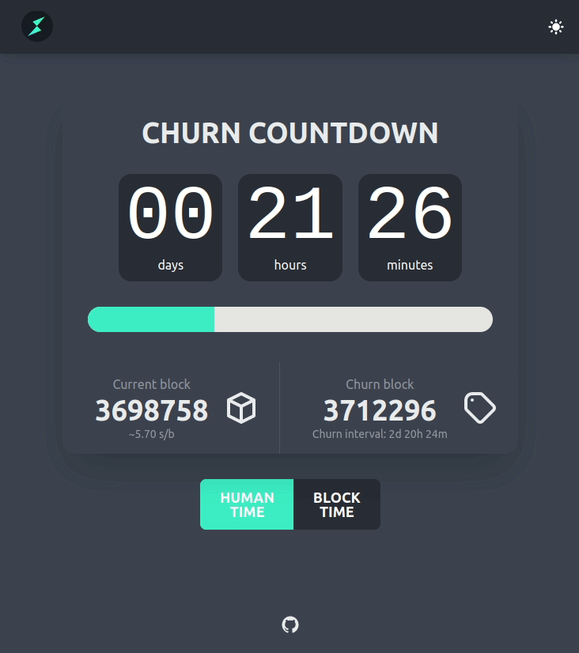

# THORChain Churn Countdown

**LIVE** :eyes: https://veado.github.io/thorchain-churn-countdown



## How does it work

The app fetches data from [Midgard](https://midgard.ninerealms.com/v2/doc) (churn interval, next churn) and subscribes to [THORChain](https://docs.thorchain.org/)'s websocket events (powered by [Tendermint RPC](https://docs.tendermint.com/master/rpc/#/Websocket)) to get latest block data (block height, block time). Data are displayed in human or block time. Since block times are different, the app self adjusts values over time to get an average block time.

## Local development

```bash
# install dependencies (only once)
npm i
# run app locally - open http://localhost:3000/thorchain-churn-countdown/
npm run dev
```

## Prepare deployment

```bash
# Build sources for deployment into 'dist` folder
npm run build
# check deployment locally by opening http://localhost:5000/thorchain-churn-countdown/
npm run preview
```

All sources in `dist` folder are ready to deploy.

## ENV

Use following `ENV`'s to change URLs of `Midgard` and `THORNode` endpoints.

```
# Midgard API url
VITE_MIDGARD_API_URL=https://midgard.ninerealms.com/v2
# THORNode RPC url for websocket
VITE_THORNODE_WS_URL=wss://rpc.ninerealms.com/websocket
# THORNode API url
VITE_THORNODE_API_URL=https://thornode.ninerealms.com
```

Put these ^ into an `.env` file before building the app. Take [env.sample](env.sample) as an example.

## Build with (in alphabetical order)

- [daisyUI](https://daisyui.com)
- [Day.js](https://day.js.org)
- [fp-ts](https://gcanti.github.io/fp-ts/)
- [RxJS](https://rxjs.dev)
- [Svelte](https://svelte.dev)
- [Vite](https://vitejs.dev/)
- [TypeScript](https://www.typescriptlang.org/)

## Licence

[MIT](./LICENSE)
